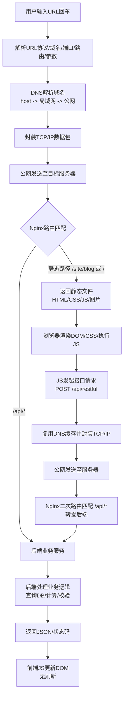

> [【全栈】前后端网络通讯过程_哔哩哔哩_bilibili](https://www.bilibili.com/video/BV1gG411V7Jn?spm_id_from=333.788.videopod.sections&vd_source=2f77333171bf218363bd788130fedf99)

### 视频核心讲解图片

### 基于学习该视频个人总结

#### 1. 在用户浏览器中地址栏输入URL回车

- 浏览器会解析url中几个参数 url = protocol(协议: http/https/file...)+domain(域名)+port(端口号)+route(路由)+params(参数)。注意：每个协议有对应的缺省值端口号 比如http对应是80;https对应是443

#### 2. 操作系统封装请求

- 在用户操作系统中domain大部分人都是输入的是域名，这样的话http请求就会通过DNS翻译域名成真实的ip地址，然后按照TCP/IP协议，会把HTTP请求封装成网络数据包，加上源地址、目标地址、端口等信息。
- 这里的DNS本机的host**优先级**最高其次是局域网(比如路由器上配置的DNS server)最后再是互联网，前两者都是查找有无保存过的域名对应的ip地址。如果是本来就填的是ip的话就会省略这个DNS过程

#### 3. ip包会被发到公网上，ip包随后会被发到目标服务器

#### 4. 服务器路由匹配

- WEB 服务器（如 Nginx）收到请求后，读取请求的域名、端口、路径
- 按照预设的Web 反向代理服务器（最常用 Nginx）的路由配置进行分流：
    - `/api/xxx` 开头的路径：转发给后端业务服务（如 Node.js、Java 服务）；
    - `/site/blog` 开头的路径：指向服务器本地的静态文件文件夹；
    - `/` 根路径：默认指向本地静态资源入口；

#### 5.返回文件 html,css,js,images

#### 6.浏览器渲染解析

- 浏览器解析 HTML 生成 DOM 树，加载 CSS 渲染样式，加载并执行 JS 脚本；
- JS 执行过程中会完成「前端路由解析」（Vue/React 等单页应用的前端路由），最终渲染出完整页面。

***

页面加载完后，前端JS还会主动发起第二轮请求，目的是获取业务动态数据，实现页面无刷新更新内容

#### 7.js发起接口请求

- 页面中的 JS 代码（通过 axios、fetch 等）向后端接口发起请求，示例为 `POST /api/restful`（POST 一般用于提交数据、传递复杂参数）。

#### 8.再次封装网络请求

- 生成对应方法（POST）的 HTTP 请求，同时带上请求头、请求 Body（POST 的参数主体）；
- 域名相同时会复用 DNS 缓存，再次封装为 TCP/IP 数据包。

#### 9.又一个ip包会被发到公网上，ip包随后会被发到目标服务器

#### 10. 服务器二次路由匹配：

- WEB 服务器收到请求，路径 `/api/restful` 匹配到「转发给后端服务」的规则；
- 请求不会再访问本地文件，而是被转发给对应的后端业务服务。

#### 11. 后端处理并返回结果：

- 后端服务根据请求的路由、HTTP 方法、查询参数、请求头、请求 Body，执行业务逻辑（查询数据库、数据计算、校验等）；
- 处理完成后，返回对应格式的结果：最常用的是 JSON，也支持纯文本、HTML、XML，或是错误状态码。

#### 12.前端动态更新：JS 拿到响应数据后，修改页面 DOM，实现内容刷新，整个过程不需要刷新整个页面。

### 核心总结

1. 两次请求本质都是「HTTP 请求 - 响应」，但目标不同：第一次拿页面静态资源，第二次拿业务动态数据；
2. WEB 服务器（Nginx 等）是「流量分流器」：静态路径返回本地文件，接口路径转发给后端服务；
3. 前端路由在浏览器本地执行，后端路由在服务器上匹配，二者是完全不同的概念；
4. 所有 HTTP 请求最终都会被封装成 TCP/IP 数据包，通过网络底层协议完成传输。

### 最后让ds帮我根据该流程生成了一幅Mermaid 流程图

